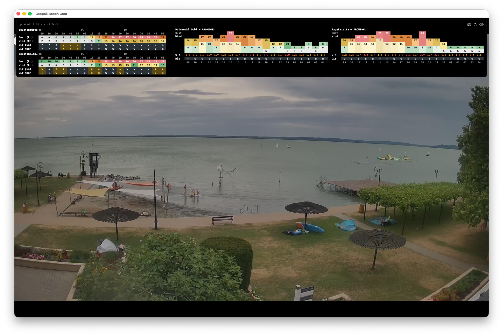

# Csopak Beach Cam

SwiftUI clients for a live beach camera in Csopak, Hungary, powered by [IPCamLive](https://ipcamlive.com/). The project ships four apps from one workspace: **iPhone/iPad**, **Apple TV**, **Mac**, and **Apple Watch**.



## Platforms

| Target | Behavior |
|--------|----------|
| **iOS** (`CsopakBeachCam`) | Embeds the IPCamLive web player in a `WKWebView` with inline playback and pinch-to-zoom. The idle timer is disabled so the screen stays on while you watch. Rotating to landscape shows the same wind/forecast overlay as macOS/tvOS across the top of the video, plus a key button for entering Windguru PRO credentials. |
| **tvOS** (`CsopakBeachCamTV`) | Resolves the HLS stream URL and plays it with `AVPlayerViewController` (chrome-less — no transport bar, no PiP/volume buttons). The same MET.hu wind/forecast overlay used on macOS is pinned to the top of the screen, always visible, covering the in-stream watermark. |
| **macOS** (`CsopakBeachCamMac`) | Menu-bar-only app (no Dock icon). Click the menu bar icon to drop down a small live preview; click anywhere inside the preview to detach it as a resizable window; click the menu bar icon again to re-attach. Right-click the icon for **Quit**. The detached window's position and size are remembered between sessions. Display sleep is suppressed via `IOPMAssertion` while the stream is playing. The HLS stream is played with `AVPlayerView` (no transport controls or hover dimming). The detached window also overlays live wind data and a short-term forecast for the two nearest MET.hu stations (Balatonfüred, Balatonalmádi); the overlay can be hidden/refreshed from its header. A map button in the same header swaps the video for MET.hu's AROME model forecast maps of Lake Balaton — today's frames laid out as a paged grid of thumbnails, steppable with the on-screen controls or the arrow keys. |
| **watchOS** (`CsopakBeachCamWatch`) | Fetches periodic JPEG snapshots (about every 5 seconds) for a lightweight wrist experience. |

Shared logic lives under `Shared/` (linked into all four app targets):

- `CameraConfig` — camera alias / player URL.
- `StreamManager` — loads the IPCamLive player HTML, derives the stream state API URL, reads JSON, and produces HLS (`stream.m3u8`) and snapshot (`snapshot.jpg`) URLs.

The weather overlay lives under `SharedWeather/` (linked into the iOS, macOS, and tvOS targets):

- `WeatherFetcher` / `WeatherViewModel` — pull the latest 10-minute observations (wind speed, gusts, direction, temperature) for each target station from the [MET.hu open data portal](https://odp.met.hu/) and an hourly wind forecast from the [Windguru](https://www.windguru.cz/) Micro endpoint using the AROME-HU 2.5 km model. Polls every ~90 s; on transient failures the previous good values are kept so the overlay never flickers blank.
- `WindguruCredentialsStore` / `WindguruSettingsView` — custom Windguru spots (e.g. Palóznaki Öböl) require a Windguru PRO account; credentials are entered in-app and stored in the platform Keychain.
- `MiniZip` — minimal in-process ZIP extractor (single-entry, store/deflate) used to read the MET.hu observation archives without a third-party dependency.
- `WeatherOverlayView` / `WeatherStyling` — Beaufort-coloured, monospaced grid rendered on top of the video, with a combined wind + gust bar graph and wind-direction arrows on forecast rows. Its map/refresh/hide buttons are gated to macOS; on iOS and tvOS the overlay is render-only.

The Balaton forecast-map browser (`BalatonMapView`) is macOS-only and lives in `CsopakBeachCamMac/` — it scrapes the frame list from MET.hu's [Balaton model forecast page](https://met.hu/idojaras/tavaink/balaton/) and prefetches today's images.

## Requirements

- **Xcode** with current iOS, tvOS, macOS, and watchOS SDKs (project targets **iOS 18.5**, **tvOS 18.5**, **macOS 14**, **watchOS 11** as configured in the Xcode project).
- Valid **signing** for each bundle identifier you build (Apple Watch companion apps must use a bundle ID prefixed with the iOS app’s bundle ID plus a dot; see Apple’s Watch app packaging rules).

## Building

1. Open `CsopakBeachCam.xcodeproj` in Xcode.
2. Select the scheme for the platform you want: **CsopakBeachCam**, **CsopakBeachCamTV**, **CsopakBeachCamMac**, or **CsopakBeachCamWatch**.
3. Choose a simulator or device, then **Run** (⌘R).

For the **macOS** scheme, pick **My Mac** as the destination. After launch the app has no window or Dock icon — look for the sailboat icon in the menu bar.

Unit and UI test targets exist for iOS and tvOS.

## Releases

Pushing a tag that starts with `v` triggers the release workflow (`.github/workflows/release.yml`): it builds the macOS menu-bar app in Release configuration on a GitHub-hosted Mac runner, ad-hoc signs it, and publishes the zipped app bundle as a GitHub release with auto-generated notes. The tag (minus the `v`) is injected as the app's marketing version.

To cut a release:

```bash
git tag v1.1.0
git push origin v1.1.0
```

Only the macOS app is attached to releases — the iOS, tvOS, and watchOS apps need Apple Developer signing to be installable and are built from source instead. The released app is ad-hoc signed but **not notarized**, so Gatekeeper quarantines the download: right-click the app and choose **Open** on first launch (or `xattr -d com.apple.quarantine CsopakBeachCamMac.app`).

## Pointing at another camera

Change the IPCamLive alias in `Shared/CameraConfig.swift` (`uniqueId` and related URLs). The same value is used by all targets that resolve streams through `StreamManager`.

## Helper script

`get-m3u8-playlist-from-ipcamlive.js` is a small **Node.js** utility that mirrors the URL extraction flow in `StreamManager` — useful for debugging or verifying stream endpoints outside the app:

```bash
node get-m3u8-playlist-from-ipcamlive.js
```

(Requires a recent Node with `fetch`.)

## Third-party stream

Video is served by **IPCamLive** and its CDN; availability and terms depend on that service. This repository only contains the client apps.

## License

This project is released under the [MIT License](LICENSE).
